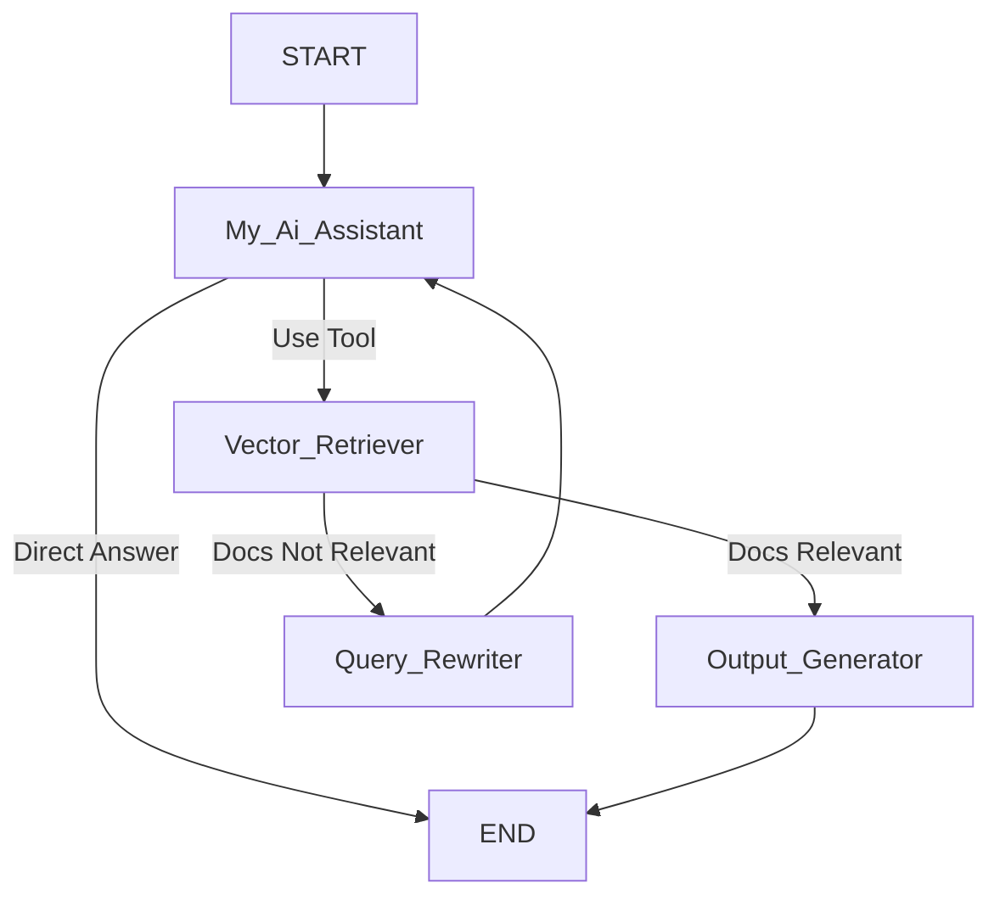
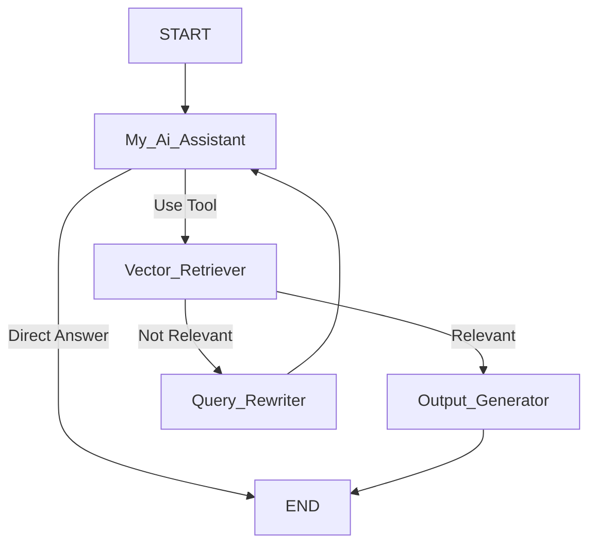

# 🧠 Agentic RAG System with LangChain & LangGraph

This project implements an **Agentic Retrieval-Augmented Generation (RAG) system** using **LangChain**, **LangGraph**, and **Groq’s Gemma2-9b-It LLM**.
It goes beyond traditional RAG by introducing **decision-making agents** that:

* Retrieve documents 🔍
* Grade their relevance ✅/❌
* Rewrite queries when retrieval fails ✍️
* Generate accurate, context-aware answers 💡

The pipeline dynamically adapts to user queries to ensure **better retrieval quality and response accuracy**.

---

## 🚀 Features

* ⚡ **Agentic Workflow** with LangGraph (multiple nodes & conditional flows).
* 📚 **Retriever Tool** built on Chroma VectorStore with HuggingFace embeddings.
* 🤖 **AI Assistant** that decides when to use retrieval vs. direct answering.
* ✅ **Relevance Grader** to filter useful vs. irrelevant documents.
* 🔁 **Query Rewriter** for poorly retrieved queries.
* 📝 **RAG Prompt Template** from LangChain Hub.
* 🌐 Loads blog posts from **Lilian Weng’s articles** (agents, prompt engineering, adversarial attacks).
* 🎨 **Mermaid Graph Visualization** of the agent workflow.

---

## 📂 Project Structure

```bash
agentic-rag/
│── main.ipynb / main.py      # Core implementation
│── requirements.txt          # Python dependencies
│── README.md                 # Project documentation
│── .env                      # API keys (not tracked in git)
```

---

## 🔑 Requirements

* Python 3.10+
* [LangChain](https://www.langchain.com/)
* [LangGraph](https://github.com/langchain-ai/langgraph)
* [Chroma](https://www.trychroma.com/)
* [Groq API](https://console.groq.com/)

Install dependencies:

```bash
pip install -r requirements.txt
```

---

## ⚙️ Setup

1. Clone this repository:

   ```bash
   git clone https://github.com/yourusername/agentic-rag.git
   cd agentic-rag
   ```

2. Create a `.env` file and add your keys:

   ```env
   GOOGLE_API_KEY=your_google_key
   TAVILY_API_KEY=your_tavily_key
   GROQ_API_KEY=your_groq_key
   LANGCHAIN_API_KEY=your_langchain_key
   ```

3. Run the script:

   ```bash
   python main.py
   ```

---

## 🔄 Workflow

The system is implemented as a **LangGraph State Machine**:



### Nodes:

* **My_Ai_Assistant** → Handles input, decides retrieval vs direct answer.
* **Vector_Retriever** → Retrieves chunks from Lilian Weng’s blogs.
* **grade_documents** → Validates if docs are useful (`yes/no`).
* **Output_Generator** → Uses RAG prompt to generate final answer.
* **Query_Rewriter** → Reformulates bad queries and loops back.

---

## 🧪 Example Queries

```python
app.invoke({"messages":["What is an Autonomous Agent?"]})

app.invoke({"messages":["What is prompt engineering in terms of agents and LangChain?"]})

app.invoke({"messages":["What is the capital of Sri Lanka?"]})
```

✅ For agent-related questions → retrieval + RAG answer.
✅ For irrelevant/general queries → direct LLM answer.

---

## 📊 Visualization

The compiled workflow generates a **Mermaid diagram**:



---

## 🔮 Future Improvements

* Add **multi-document grading** (beyond yes/no).
* Support **multi-retriever selection** (web search + vectorDB).
* Implement **self-reflection loops** for higher accuracy.
* Deploy as an **API endpoint** or **Chatbot UI**.

---

